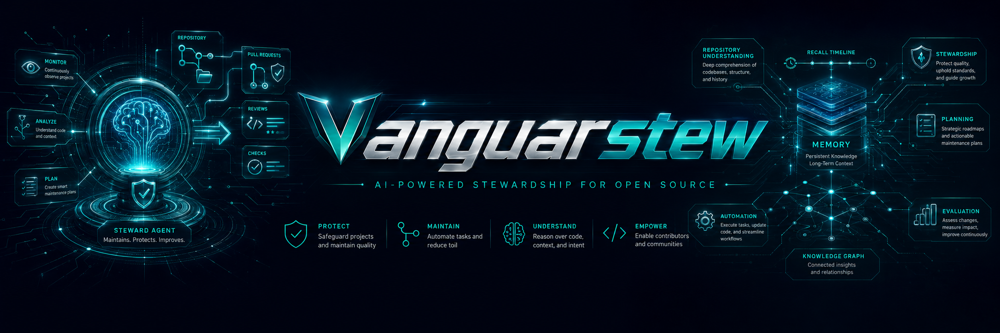
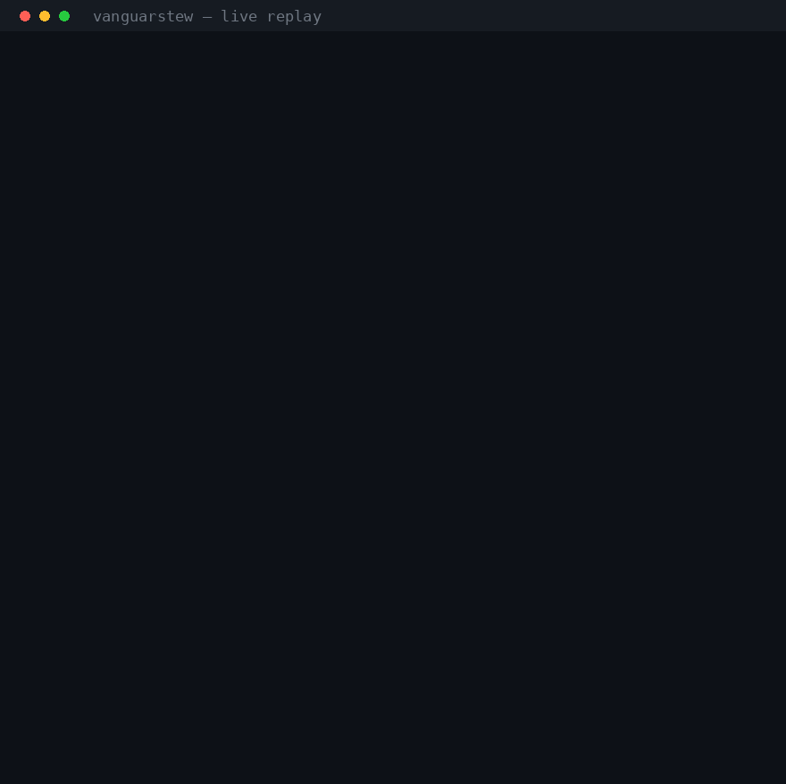

<p align="center">
  
</p>

# Vanguarstew — OpenVang maintainer-intelligence component

[](https://github.com/openvang/vanguarstew/actions/workflows/ci.yml)
[](LICENSE)
[](https://www.python.org/)
`vanguarstew` is OpenVang's maintainer-intelligence component: a repository-maintainer agent,
history-derived benchmark, private review runtime, and verifiable-compute foundation. It is designed
to be one specialist inside a Bittensor subnet owner workflow—not a subnet-specific contribution or
reward program.

The core question it answers is not *"did the agent write good code?"* but *"does the agent understand where this repository is going, and would it have steered it the way the real maintainers did?"*

See [ROADMAP.md](ROADMAP.md) for the product sequence,
[docs/architecture.md](docs/architecture.md) for the component architecture, and the
[OpenVang agent-factory design](docs/openvang-agent-factory.md) for role and owner-action boundaries.
The optional, controller-owned [persistent-memory design](docs/persistent-memory.md) documents live
and time-safe benchmark modes.
The local [memory ablation protocol](docs/memory-ablation.md) defines how to test memory against
matched frozen tasks without fabricating a performance claim.

The first verifiable-compute milestone is a fixed, public, non-secret
[Polaris TEE receipt pilot](docs/polaris-public-tee-pilot.md). It validates execution-integrity
receipts without claiming workload confidentiality or GPU provenance.

## Why this matters

Software development is bottlenecked less by writing code than by **maintaining** it —
triaging, reviewing, prioritizing, and steering a codebase over time. That maintainer
capacity is the real ceiling on how much useful software actually ships.

vanguarstew turns that bottleneck into a measurable optimization problem: *can an agent make
the maintainer decisions a strong human maintainer would have made?* By scoring against real
GitHub history, it builds a benchmark for maintainer capability — and a path to scaling it.

## Demo



A **live** replay against a real model (frozen at a past commit, agent sees only history up
to there). It infers the repo's maintainer philosophy and plans the next actions — its top
call (quick-router fixes) and its read of the direction (toward v1.0) match what the
maintainers actually did next. Scored on trajectory + decision process; the pairwise judge
picks the agent over an empty baseline.

## How it works

```
freeze a repo @ time T  ──>  agent infers the repo's "maintainer philosophy",
                             then plans the next N maintainer actions / PRs
                                      │
reveal the actual history T→T+N  ──>  pairwise judge: whose plan is more
                                      consistent with where the repo actually went?
```

The agent is judged on **direction/theme match** (not exact-PR match), with an **objective anchor** (concrete decisions that have a hard ground truth — merge/reject, labels, reviewer, version bump) and a **judged layer** (trajectory + decision process), scored **pairwise** like ninja, averaged over many freeze-points and repos.

## The agent — what it actually does

The maintainer agent lives in [`agent/`](agent/). Given a repository frozen at a moment in time,
it decides what a strong maintainer would do next — in four steps:

1. **Infer the "maintainer philosophy."** Before deciding anything, it reads the repo's
   history, README, and recent activity to work out the project's values and direction —
   conservative or fast-moving? refactor-first? heading toward a 1.0 release? This grounds
   everything that follows, and it's the hardest, most important part.
2. **Read the situation.** Open issues, open PRs, recent commits, releases — the maintainer's
   working surface as of that moment (and nothing from the future).
3. **Plan and decide.** Propose the next maintainer actions / PRs and the concrete calls
   (merge / request-changes / reject, triage, reviewer, release) — each with its reasoning.
4. **Implement when needed.** Produce an actual code patch when that's the right move — but
   writing code is only one of the actions a maintainer takes.

The benchmark then scores those decisions against what the maintainers **actually did next**.

> New here? The module layout and the full agent contract are in
> [docs/architecture.md](docs/architecture.md) and
> [docs/openvang-agent-factory.md](docs/openvang-agent-factory.md).

## Quickstart

```bash
# offline dry-run: no network, deterministic stub LLM — proves the loop wiring
VANGUARSTEW_OFFLINE=1 python -m scripts.run_eval --repo /path/to/some/git/repo --tasks 2 --horizon 5

# opt-in time-safe memory: controller-owned store, single repo, no raw memory in the artifact
VANGUARSTEW_OFFLINE=1 python -m scripts.run_eval --repo /path/to/some/git/repo \
    --memory-mode benchmark --memory-store /controlled/memory.sqlite \
    --memory-repository-id owner/repo --tasks 2 --horizon 5

# live run against a managed-inference endpoint (ninja-style contract)
python -m scripts.run_eval --repo /path/to/repo --tasks 5 --horizon 5 \
    --model <validator-model> --api-base http://validator-proxy/v1 --api-key "$TOKEN"

# multi-repo: replay several repos and aggregate a cross-repo composite (generalization)
VANGUARSTEW_OFFLINE=1 python -m scripts.run_eval --repos /path/to/a /path/to/b --tasks 2 --horizon 5

# repo-set: replay a checked-in curated config (clone listed repos locally first)
VANGUARSTEW_OFFLINE=1 python -m scripts.run_eval --repo-set benchmark/repo_sets/curated.json --tasks 2 --horizon 5

# validate a repo-set JSON before replay (types + freeze-window bounds)
python -m scripts.validate_repo_set benchmark/repo_sets/example.json

# smoke test (no network, no git needed)
VANGUARSTEW_OFFLINE=1 python -m pytest -q

# CI gate: exit non-zero when composite_mean drops below a floor
VANGUARSTEW_OFFLINE=1 python -m scripts.run_eval --repo /path/to/repo --tasks 2 --horizon 5 --fail-under 0.5

# compare two saved --out artifacts (JSON on stdout, headline on stderr)
python -m scripts.compare_eval baseline.json candidate.json

# render a saved --out artifact as a readable Markdown report
python -m scripts.report result.json

# rank several saved --out artifacts (pick the best candidate agent)
python -m scripts.leaderboard agent_a=run_a.json agent_b=run_b.json
```

## Run as a private service

The benchmark loop and live maintainer-assist runtime are separate. For a
simple local, restart-safe service that keeps review material private:

```bash
cp .env.example .env
cp vanguarstew.json.example vanguarstew.json
python -m pip install -e .
vanguarstew doctor
vanguarstew serve
```

The initial configuration is safe and inert: no polling, inference, GitHub
mutation, or public reviewer output. See the [product runtime plan](docs/product-runtime-plan.md)
for the deliberate live-pilot opt-in, Docker Compose/systemd operation, and the
private-review boundary.

> **Dev-only backend:** [`tools/codex_llm.py`](tools/codex_llm.py) can drive the benchmark and
> maintenance tooling from a locally-authenticated `codex` CLI (ChatGPT / OAuth, e.g. gpt-5.5)
> with **no API key** — convenient for local exploration. It is for development only: the
> scored `agent.solve` path always uses validator-supplied inference (the managed-inference
> contract in [`agent/llm.py`](agent/llm.py)), never codex.

`--repo` scores one repo; `--repos` scores several and averages each repo's own
`composite_mean` into one cross-repo number. Each single-repo `run_replay` result carries the
composite contract — `composite_mean` plus `composite_parts` (the `judge_mean` and
`objective_mean` it blends, per the `weights`) — and a `foresight` breakdown that un-blends
`objective_mean` into the three concrete, independently-checkable questions behind it (did the
agent predict the modules / commit-kinds / releases the maintainers actually produced), each with
its own sample size (`_n`) so an axis with no applicable tasks reports `null` rather than a
fabricated 0.0 (M7):

```jsonc
// single-repo (--repo) result, composite fields:
{
  "composite_mean": 0.6,                              // mean blended score in [0, 1]
  "composite_parts": { "judge_mean": 1.0, "objective_mean": 0.0 },  // the two blended means
  "foresight": {                                      // the objective_mean components, unblended
    "module_recall_mean": 0.75, "module_recall_n": 4,
    "kind_recall_mean": 0.5, "kind_recall_n": 4,
    "release_accuracy": null, "release_accuracy_n": 0  // no release in this run's window
  },
  "weights": { "judge": 0.6, "objective": 0.4 },     // how the parts are blended
  "rows": [ /* per-task: winner, objective, composite */ ]
}
```

The `--repos` aggregate result shape is:

```jsonc
{
  "repos": 2,            // repos given
  "scored_repos": 2,     // repos that produced tasks (and a composite_mean)
  "skipped": 0,          // repos too small for the horizon (kept below, excluded from the mean)
  "composite_mean": 0.6, // mean of each scored repo's composite_mean
  "composite_parts": { "judge_mean": 1.0, "objective_mean": 0.0 },  // means of the per-repo parts
  "foresight": { "module_recall_mean": 0.75, "module_recall_n": 4, /* ... */ },  // same shape, combined across scored repos
  "per_repo": [ /* each repo's full run_replay result, or its {"error": ...} */ ]
}
```

## Status

**Active development.** The current foundation includes history-derived replay, objective and
judged scoring, leakage defenses, time-safe persistent memory, Polaris-backed execution-integrity
receipts, and a private restart-safe maintainer runtime. OpenVang's next layer is a role-separated
subnet agent factory. It has no automatic owner key, on-chain action, GitHub write, or public review
publication path. See [ROADMAP.md](ROADMAP.md).
